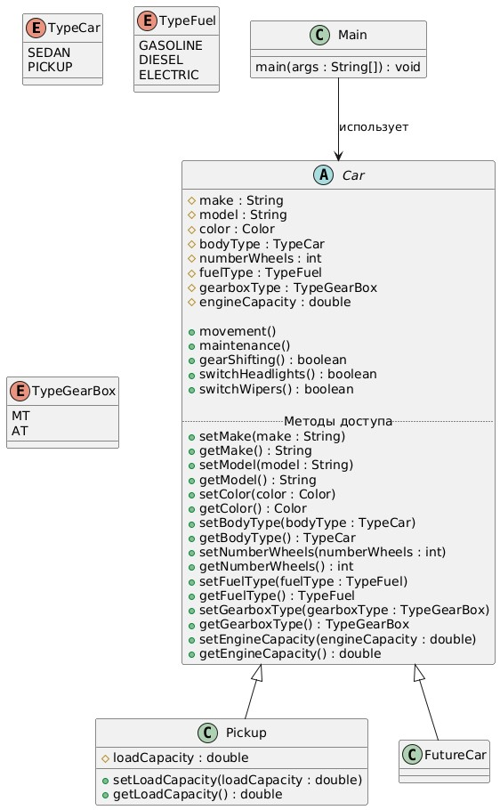
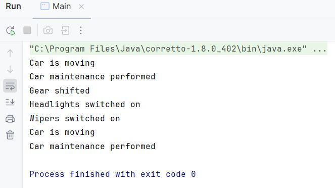

# Архитектура ПО
### Урок 3. Принципы SOLID

**Задание 1**. Сдать код с семинара и сделать UML-диаграмму по коду. 
UML-диаграмму можно сделать в любом редакторе. 
Диаграмма сдается файлом формата jpg.

**Задание 2**. (Задание со звездочкой) 
Конвертировать 3 паттерна с UML-диаграмм в код. 
Схемы паттернов приложены к уроку.

## РЕШЕНИЕ:

1. Код

[main.java](src/main.java)

2. Диаграмма UML

 

3. Скриншот примера выполнения кода

    
   

   

